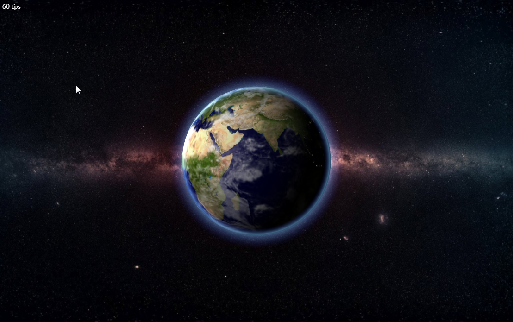

# WebGL Earth
## About
 

Based on the globe rendering used in my game Projekt "W" (http://www.saschawillems.de/?page_id=829), this demo renders earth using a day/night shader including an atmosphere (also calculated inside the shader). It also uses offscreen rendering to add atmosphere and night light glow to the scene.

Not nearly realistic, and just a quick test to prove how easy it is to port complex shaders from OpenGL to WebGL without much effort.

## Notes
If running from your hard drive (at least for Chrome) you need to allow your browser to access files from your disk (XSS).

Chrome : --allow-file-access-from-files

## External resources
### JavaScript
- AngularJS (https://angularjs.org/)
- glMatrix (glmatrix.net)
