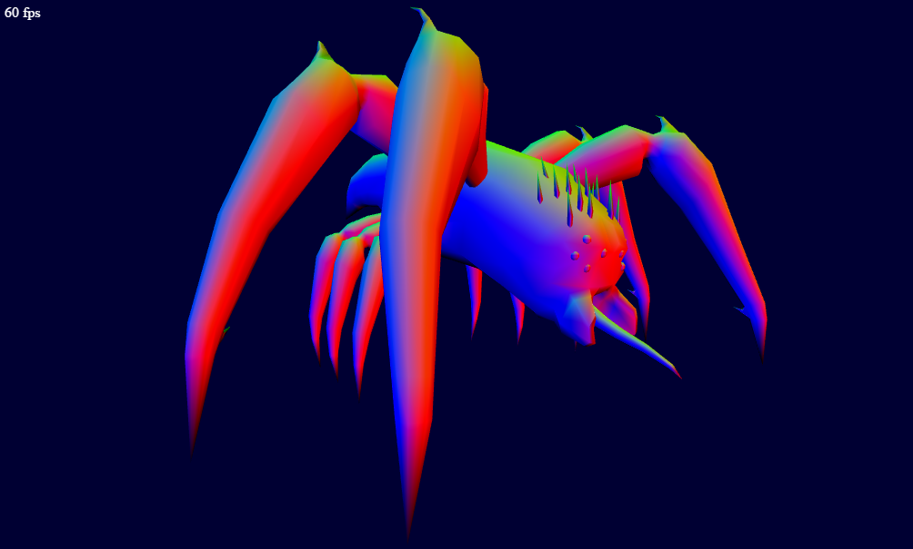

# WebGL OBJ loader (and demo)
## About
 

Basic .obj loader (objloader.js) and viewer.

Obj files are human readable, easy to parse and almost every modeller can export and import it.

objloader.js implements a basic obj loader that renders the model using WebGL.

## Usage
### Setup
Your shader for the model needs to offer the following attributes :

    attribute vec3 aVertexPosition;
    attribute vec2 aTextureCoord;
    attribute vec3 aNormal;  

And at least a sampler for the colorMap :

    uniform sampler2D sTexture;

If you need different attributes or samplers, you'll have to adjust the loader.

### Loading the model
    objModel = new ObjLoader();
    objModel.loadFromFile("model.obj", "colorMap.jpg");
    objModel.setupBuffers();
    objModel.setupShader(shaders.base);
### Rendering
    objModel.render();

## Notes
If running from your hard drive (at least for Chrome) you need to allow your browser to access files from your disk (XSS).

Chrome : --allow-file-access-from-files

## Controls
- Left mouse button + drag : Rotate model
- Mouse wheel : Zoom

## External resources
### JavaScript
- AngularJS (https://angularjs.org/)
- glMatrix (glmatrix.net)

### Content
- Beast model and texture by Psionic (http://www.psionic3d.co.uk)
