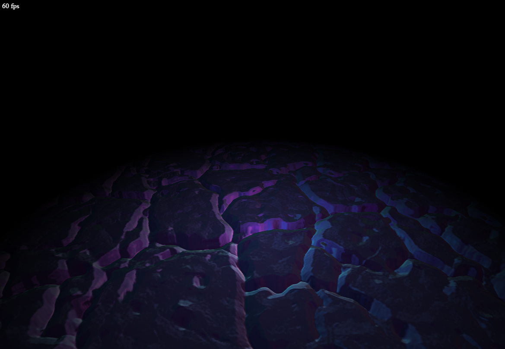
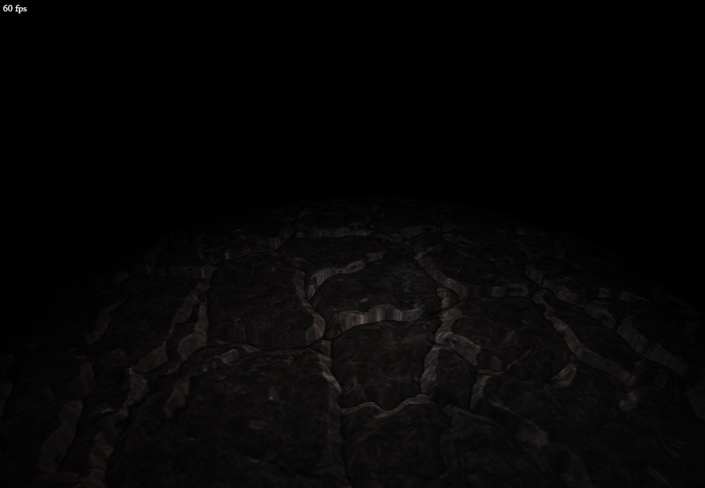
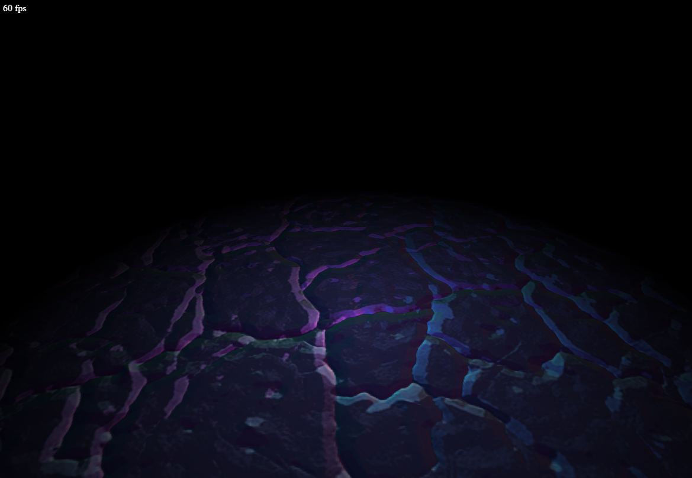
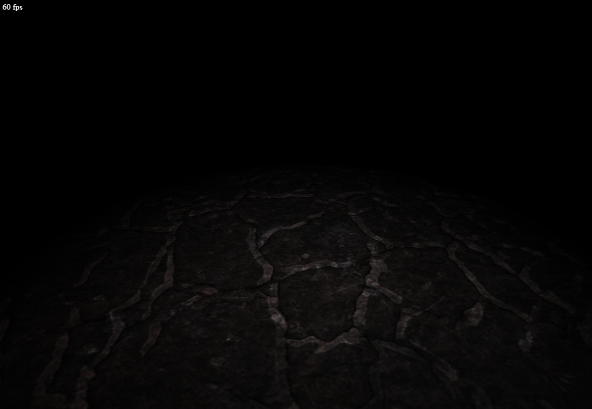

# WebGL Parallax mappong
## About
This demo shows the parallax offset mapping. It's based on normal mapping and uses an additional heightmap to add more depth to flat surfaces by offsetting the normals depending on the current view vector and scale and bias factors.

Parallax offset mapping for added depth : 
 

Normal mapping : 
 

## Notes
If running from your hard drive (at least for Chrome) you need to allow your browser to access files from your disk (XSS).

Chrome : --allow-file-access-from-files

## Controls
- Left mouse button + drag : Rotate model
- Mouse wheel : Zoom
- "T" - Toggle between parallax offset mapping and basic normal mapping
- "N" - Toggle between display of normal map and color map
- "P" - Toggle animated light

## External resources
### JavaScript
- AngularJS (https://angularjs.org/)
- glMatrix (http://glmatrix.net)

### Content
- Uses a slightly modified texture by Spiney (http://opengameart.org/content/metalstone-textures) - CC-BY 3.0 / CC-BY-SA 3.0
