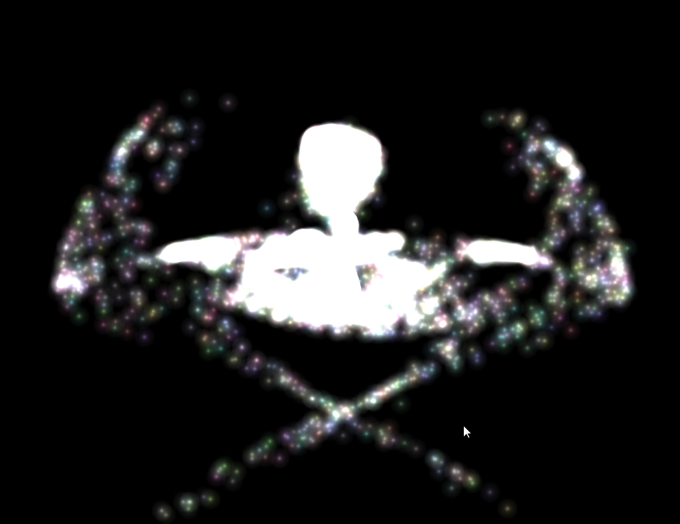
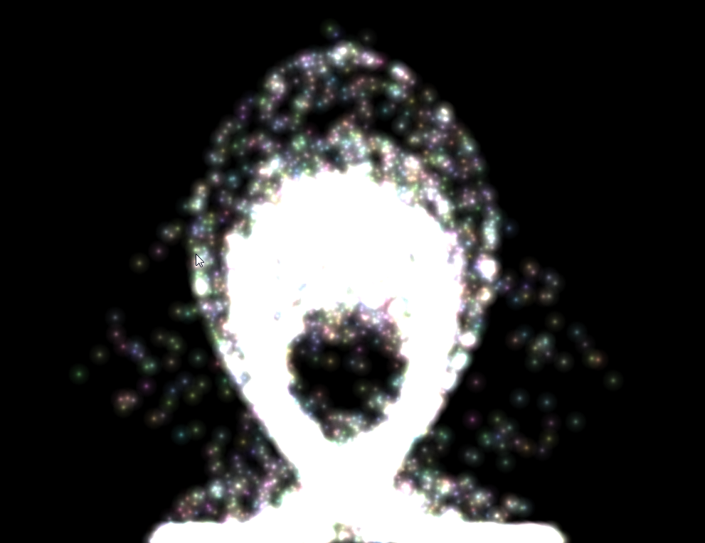
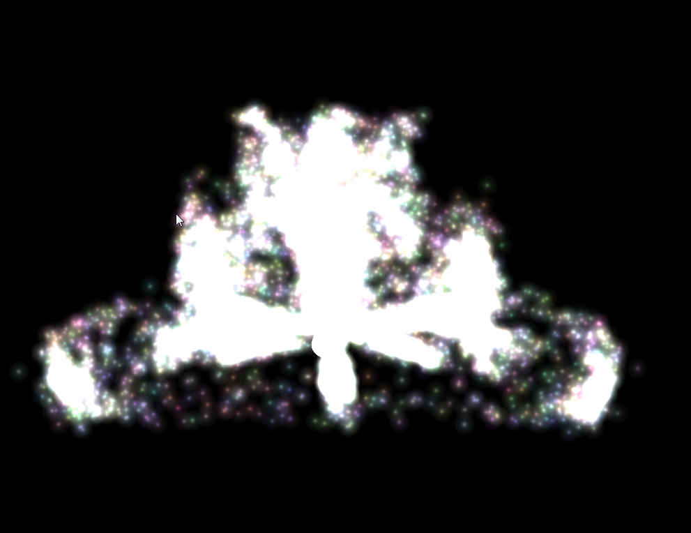
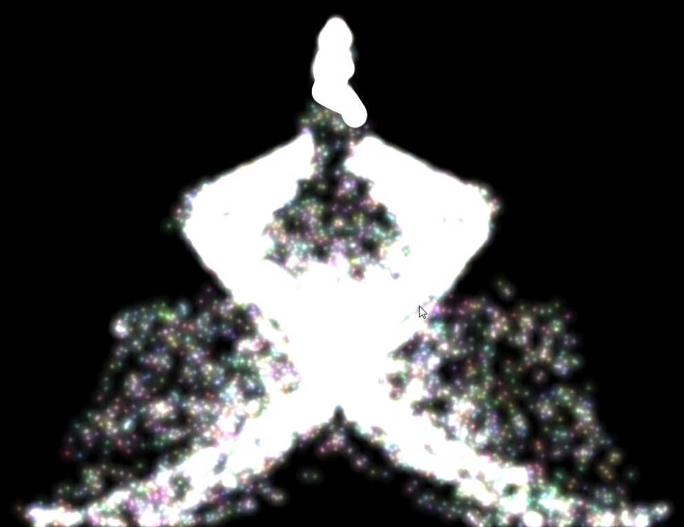

# WebGL attraction based particle system
## About
   

Simple demo showing an attraction based particle system in webgl. Vertices (position, colors) are stored in a vertex buffer, velocities are applied and calculated on the CPU.
## Controls
- Hold down the left mouse button : Move the attraction point
- "p" : Pause the scene
- "r" : Reset particles to initial (random) position
- "v" : Add random velocity to particles
- "s" : Reset particle velocities to zero
