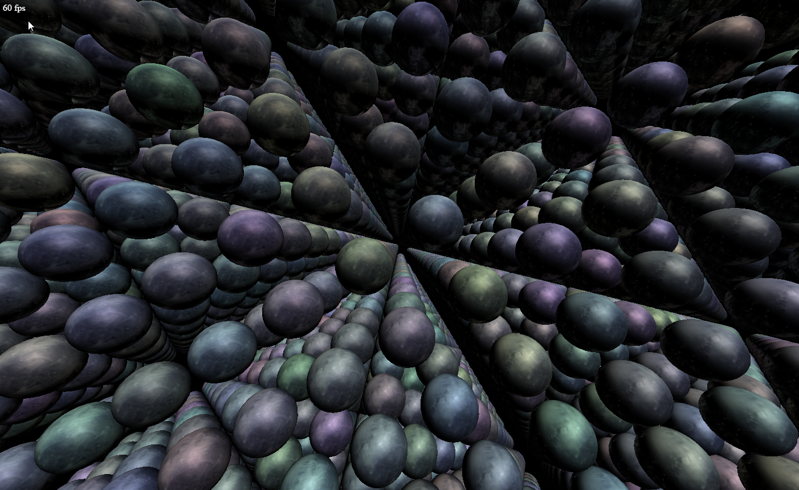

# WebGL 2 Instancing
## About

Demonstrates WebGL2's core functionality for instanced rendering of several thousand pixel shaded planets.

Instead of looping on the CPU and calling e.g. glDrawArrays for the same mesh over and over again just to set different shader parameters, instancing takes shader attributes from array buffers and allows you to draw multiple instances of the same mesh with differing shader attributes with one command, moving the load from the CPU to the GPU :

    gl.bindBuffer(gl.ARRAY_BUFFER, buffer with offsets);
    gl.vertexAttribPointer(offset attrib location in shader, 3, gl.FLOAT, false, 12, 0);
    gl.vertexAttribDivisor(offset attrib location in shader, 1);
    ...
    gl.drawArraysInstanced(gl.TRIANGLE_STRIP, 0, number of vertices to render, number of instances to render);

Instancing has been available in WebGL using the ANGLE_instanced_arrays extensions and is now part of the core for WebGL2.    

## Notes
Only works with WebGL2. So you need a browser and GPU drivers supporting WebGL2!

If running from your hard drive (at least for Chrome) you need to allow your browser to access files from your disk (XSS).

Chrome : --allow-file-access-from-files

## External resources
### JavaScript
- AngularJS (https://angularjs.org/)
- glMatrix (glmatrix.net)

### Images
#### Pluto textures (day and night)
Copyright (c) by James Hastings-Trew (Taken from http://planetpixelemporium.com/)
